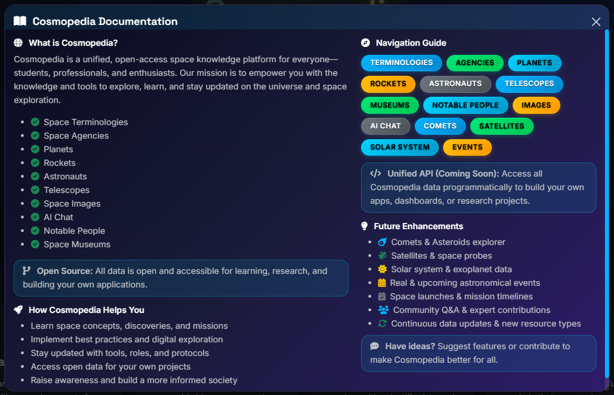
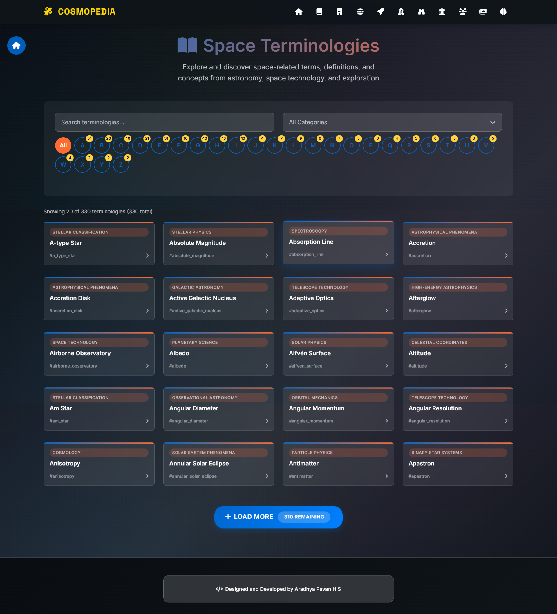
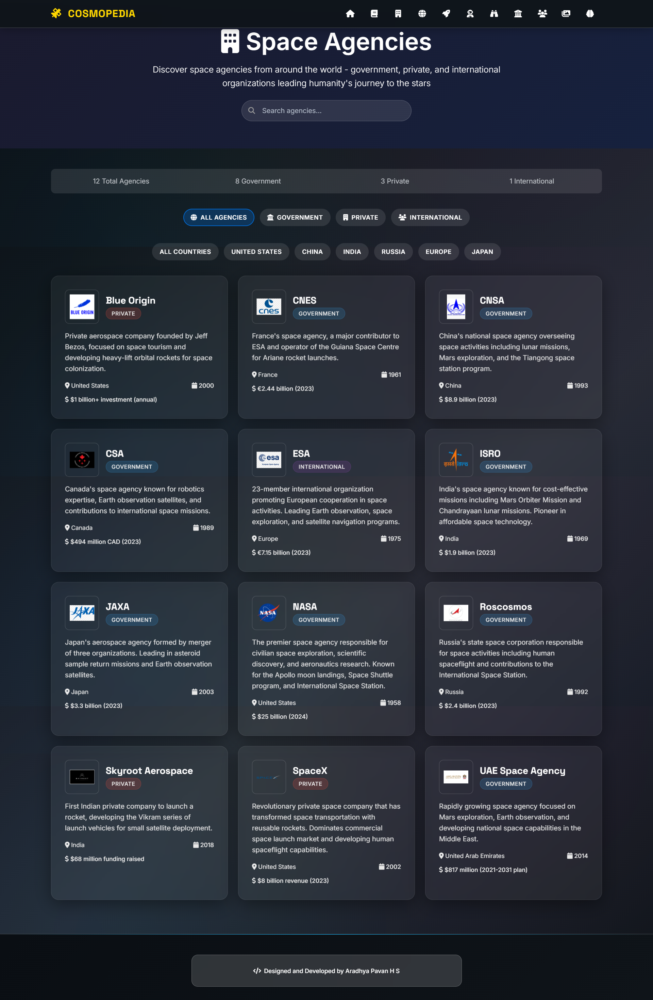
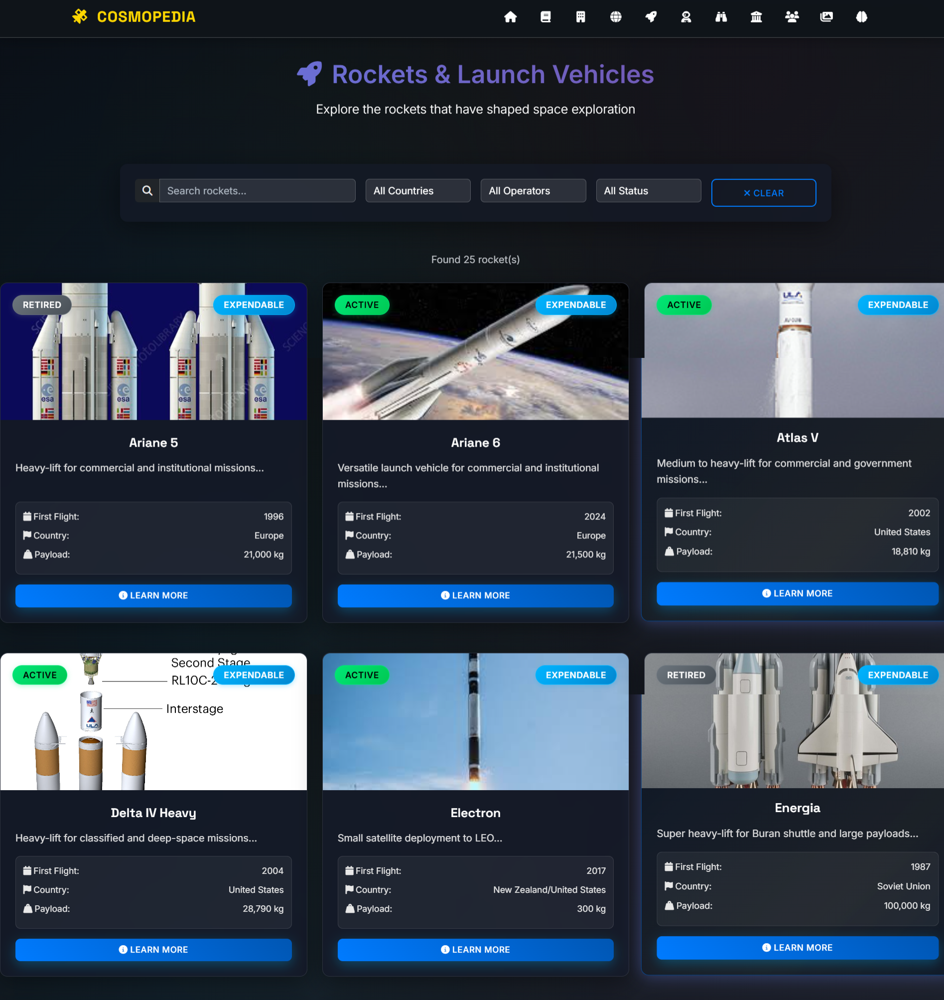
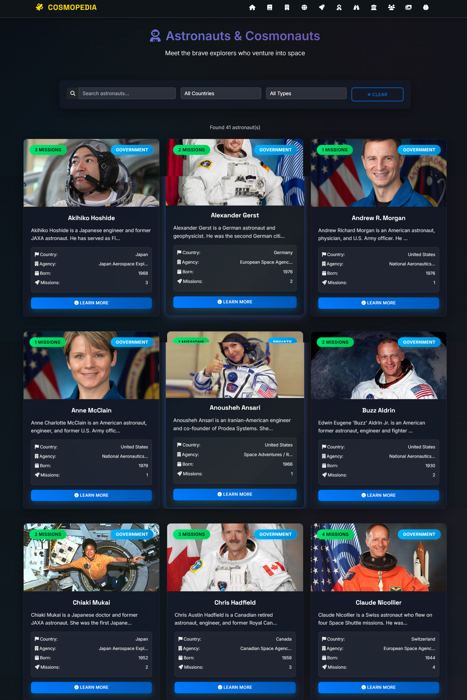
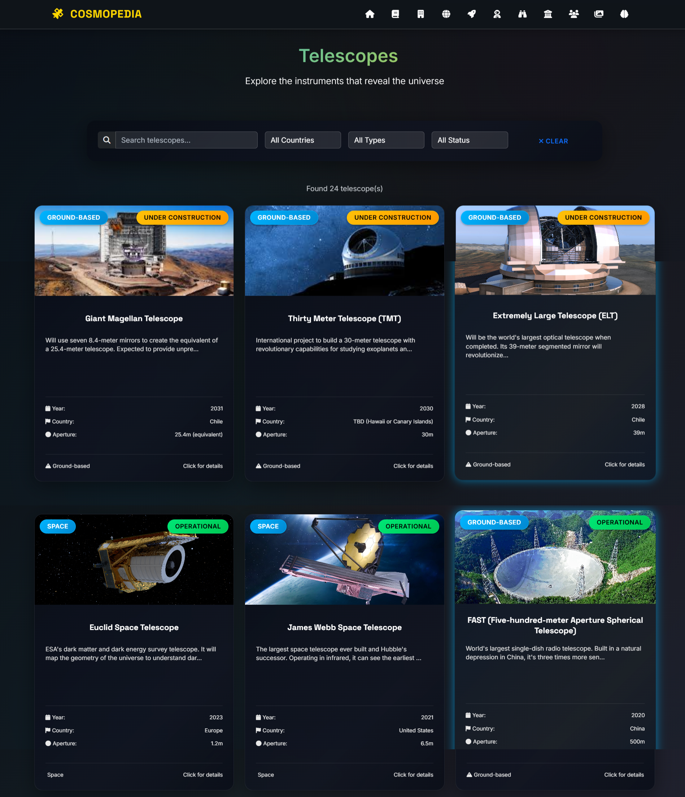
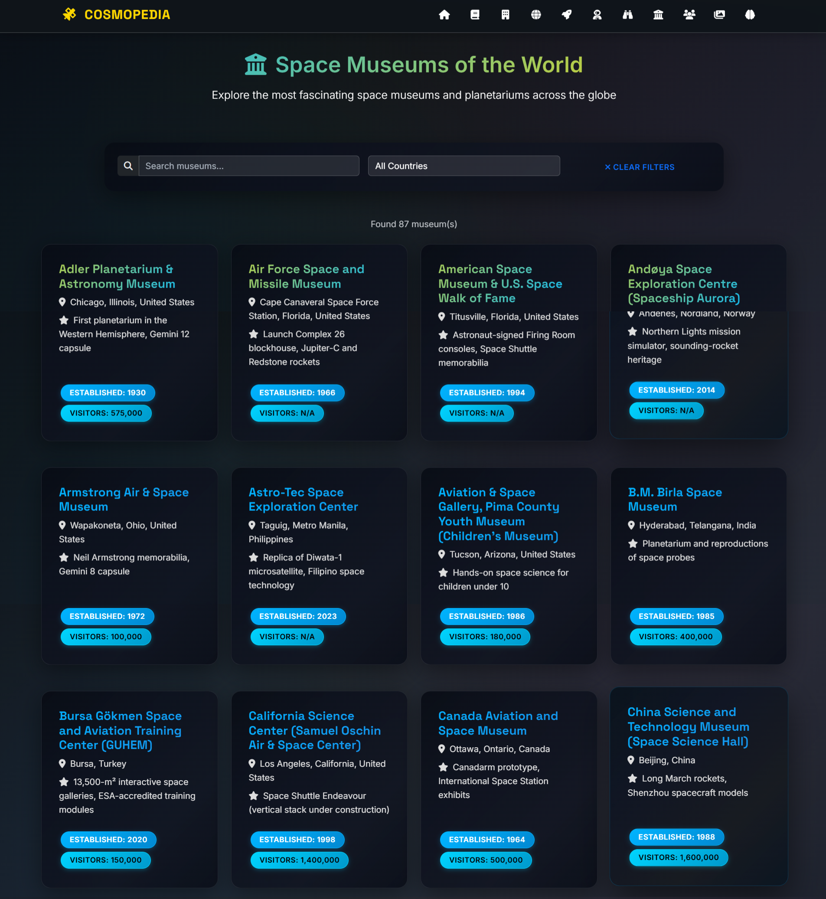
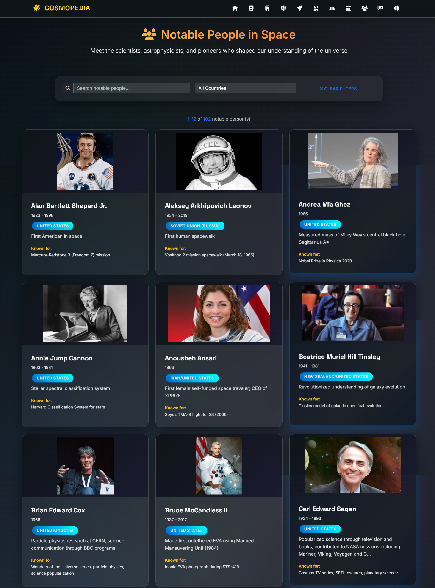
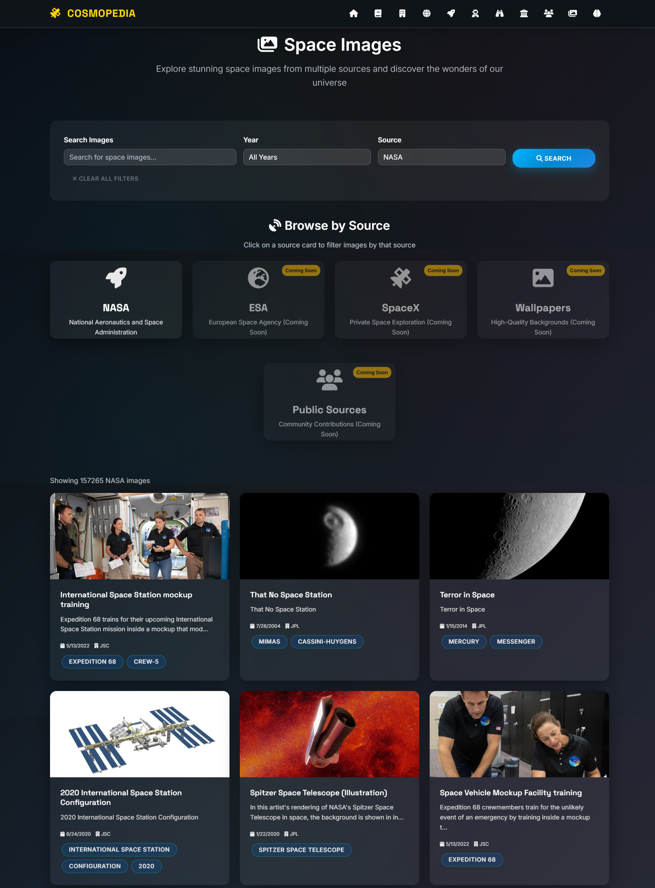

# 🌌 CosmoPedia - Unified Space Knowledge Platform

## 💡 Inspiration

As space aspirants, my team and I were constantly frustrated by the scattered nature of space-related information across the internet. Whether we were researching rockets, learning about astronauts, or exploring space terminology, we had to visit multiple websites and sources. We realized there was no single, comprehensive platform where space enthusiasts could access all this valuable information in one place. This gap inspired us to create CosmoPedia - a unified knowledge base that brings together verified space data from multiple open sources.

## 🚀 What it does

CosmoPedia is a unified, open-access space knowledge platform that consolidates space information from multiple verified open sources into a single accessible interface. Built for students, professionals, and space enthusiasts, it provides a unified experience for exploring the vast universe of space knowledge.

   

## 🖼️ Screenshots

### Main Interface

*Homepage with navigation and feature overview*


*Built-in documentation modal with comprehensive platform guide*

### Knowledge Categories


*Space terminologies database*


*Global space agencies information*


*Solar system planets data*


*Rocket systems and launch vehicle database*


*Astronaut profiles and achievements*


*Ground and space-based telescope information*


*Global space museums directory*


*Scientists and space pioneers profiles*


*NASA image gallery integration*

### AI & API Features


*AI-powered chat with vector search capabilities*


*RESTful API endpoints for all data categories*


*API documentation and testing interface*

## ✨ Platform Features

- **Space Terminologies** - Database of space-related terms and definitions
- **Space Agencies** - Information about space organizations worldwide
- **Planets** - Solar system planets with scientific data
- **Rockets** - Database of launch vehicles and rocket systems
- **Astronauts** - Profiles of space explorers
- **Telescopes** - Ground and space-based observatories
- **Notable People** - Scientists, astrophysicists, and space pioneers
- **Space Museums** - Global directory of space museums
- **Space Images** - NASA image gallery integration
- **AI Chat** - Mistral LLM-powered assistant that retrieves and enhances responses from our pre-built verified knowledge base using FAISS vector search
- **Open Source APIs** - RESTful endpoints for all data categories

## 🛠️ How we built it

We built CosmoPedia using modern web technologies with a focus on open access and API-first design:

- **Backend** - Flask (Python) for server-side processing
- **Frontend** - HTML5, CSS3, and JavaScript with space-themed responsive design
- **Data Sources** - Aggregated from multiple verified open sources
- **AI Integration** - Mistral LLM with FAISS vector search for retrieving and enhancing responses from verified knowledge base
- **API Design** - RESTful endpoints for all data categories
- **Storage** - JSON-based data storage with FAISS vector indexing for semantic search of pre-built knowledge base

## 🚧 Challenges we ran into

- **Data Aggregation** - Collecting and standardizing data from multiple open sources while maintaining accuracy
- **FAISS Integration** - Implementing vector search capabilities for semantic queries within our knowledge base
- **Mistral LLM Integration** - Setting up AI chat to enhance responses from verified knowledge base documents
- **Data Consistency** - Ensuring consistent formatting across different data categories
- **API Design** - Creating intuitive RESTful endpoints for all data types

## 🏆 Accomplishments that we're proud of

- **Unified Knowledge Base** - Successfully aggregated space data from 10 different categories into one platform
- **Open Source APIs** - Created RESTful APIs that other developers can use for free
- **AI Integration** - Implemented Mistral LLM with FAISS vector search to retrieve and enhance responses from our verified knowledge base
- **User Experience** - Designed an intuitive space-themed interface for easy exploration
- **Data Accessibility** - Made space knowledge freely accessible to students, professionals, and enthusiasts
- **Community Impact** - Built a resource for learning, research, and building space applications

## 📚 What we learned

- **Data Integration** - Gained experience in aggregating and normalizing data from multiple open sources
- **Vector Search** - Learned to implement FAISS for semantic search within our curated knowledge base
- **AI Integration** - Understood how to integrate Mistral LLM to enhance responses from verified knowledge base documents
- **API Design** - Developed skills in creating user-friendly RESTful APIs
- **Space Domain Knowledge** - Expanded our understanding of space exploration and terminology
- **Open Source Development** - Learned the importance of making knowledge freely accessible

## 🚀 What's next for CosmoPedia

- **Comets & Asteroids explorer**
- **Satellites & space probes**
- **Solar system & exoplanet data**
- **Real & upcoming astronomical events**
- **Space launches & mission timelines**
- **Community Q&A & expert contributions**
- **Continuous data updates & new resource types**

## 📖 Platform Documentation

CosmoPedia includes comprehensive built-in documentation accessible through the documentation modal on the homepage, featuring:

### What is CosmoPedia?
CosmoPedia is a unified, open-access space knowledge platform for everyone—students, professionals, and enthusiasts. Our mission is to empower you with the knowledge and tools to explore, learn, and stay updated on the universe and space exploration.

### How CosmoPedia Helps You
- Learn space concepts, discoveries, and missions
- Implement best practices and digital exploration
- Stay updated with tools, roles, and protocols
- Access open data for your own projects
- Raise awareness and build a more informed society

### Navigation Guide
The platform provides easy navigation through color-coded badges for all categories:
- Terminologies, Agencies, Planets, Rockets, Astronauts
- Telescopes, Museums, Notable People, Images, AI Chat
- Comets, Satellites, Solar System, Events (coming soon)

## 🛠️ Built With

- **bootstrap**
- **css3**
- **faiss**
- **flask**
- **html5**
- **javascript**
- **json**
- **mistral-llm**
- **python**
- **restapi**

## 🌐 Try it out

**Live Platform:** [cosmo-pedia-e6blv.ondigitalocean.app](https://cosmo-pedia-e6blv.ondigitalocean.app)

**GitHub Repo**

**API Documentation:** [cosmopedia-api-v1-d045176bccfa.herokuapp.com](https://cosmopedia-api-v1-d045176bccfa.herokuapp.com)

## 🔧 API Development & Usage

### Swagger API Documentation
Our comprehensive API is documented using Swagger/OpenAPI specifications, providing interactive documentation where developers can:
- Explore all available endpoints
- Test API calls directly from the browser
- View request/response schemas
- Understand authentication requirements
- Access code examples in multiple languages

### API Architecture
The CosmoPedia API follows RESTful principles with:
- **Base URL:** `http://127.0.0.1:5000/` (Local Development)
- **Production URL:** `https://cosmopedia-api-v1-d045176bccfa.herokuapp.com`
- **Format:** JSON responses
- **Authentication:** Open access (no API key required)
- **Rate Limiting:** Fair usage policy applied
- **CORS:** Enabled for cross-origin requests

### Available Endpoints
- `GET /api/terms` - Space terminology database
- `GET /api/agencies` - Space agencies worldwide
- `GET /api/planets` - Solar system planets data
- `GET /api/rockets` - Launch vehicles and rocket systems
- `GET /api/astronauts` - Space explorer profiles
- `GET /api/telescopes` - Observatory information
- `GET /api/notable-people` - Scientists and pioneers
- `GET /api/museums` - Space museums directory
- `POST /api/search` - Vector search across all data
- `POST /api/chat` - AI chat functionality

### How to Use the API

#### Basic Usage Example
```javascript
// Fetch all space agencies
fetch('http://127.0.0.1:5000/api/agencies')
  .then(response => response.json())
  .then(data => console.log(data));

// Search for Mars-related content
fetch('http://127.0.0.1:5000/api/search', {
  method: 'POST',
  headers: {
    'Content-Type': 'application/json',
  },
  body: JSON.stringify({
    query: 'Mars exploration missions'
  })
})
.then(response => response.json())
.then(results => console.log(results));
```

#### Python Example
```python
import requests

# Get all rockets data
response = requests.get('http://127.0.0.1:5000/api/rockets')
rockets = response.json()

# Perform semantic search
search_payload = {
    "query": "International Space Station"
}
search_response = requests.post(
    'http://127.0.0.1:5000/api/search',
    json=search_payload
)
search_results = search_response.json()
```

### Clone and Develop
Anyone can clone the CosmoPedia API and build upon it:

#### Quick Start
```bash
# Clone the main repository
git clone https://github.com/aradhyapavan/cosmopedia-docs.git
cd cosmopedia-docs

# Navigate to the Swagger API folder
cd Swagger_Api

# Install dependencies
pip install -r requirements.txt

# Run the application
python app.py

# Access the API at http://127.0.0.1:5000/
# Swagger UI available at http://127.0.0.1:5000/docs
```

#### Development Steps
1. **Fork the Repository** - Fork [https://github.com/aradhyapavan/cosmopedia-docs](https://github.com/aradhyapavan/cosmopedia-docs) to your GitHub account
2. **Clone Your Fork** - Download your forked repository locally
   ```bash
   git clone https://github.com/[your-username]/cosmopedia-docs.git
   ```
3. **Navigate to API** - Go to the `Swagger_Api/` directory within the cloned repository
4. **Local Development** - Set up the Flask application locally at `http://127.0.0.1:5000/`
5. **Explore Endpoints** - Use the Swagger UI at `http://127.0.0.1:5000/docs` for interactive API testing
6. **Create Branch** - Create a new branch for your features
   ```bash
   git checkout -b feature/your-feature-name
   ```
7. **Extend Functionality** - Add new endpoints or data categories
8. **Commit Changes** - Commit your improvements
   ```bash
   git add .
   git commit -m "Add your feature description"
   git push origin feature/your-feature-name
   ```
9. **Pull Request** - Submit a pull request to the main repository
10. **Deploy Your Version** - Host your enhanced API instance

### Integration Examples
- **Educational Platforms** - Integrate space data into learning management systems
- **Mobile Apps** - Build space exploration apps with real-time data
- **Research Tools** - Create analysis dashboards for space research
- **Chatbots** - Develop space-themed AI assistants
- **Web Applications** - Build interactive space exploration websites

---

*Built with ❤️ for space enthusiasts everywhere*
